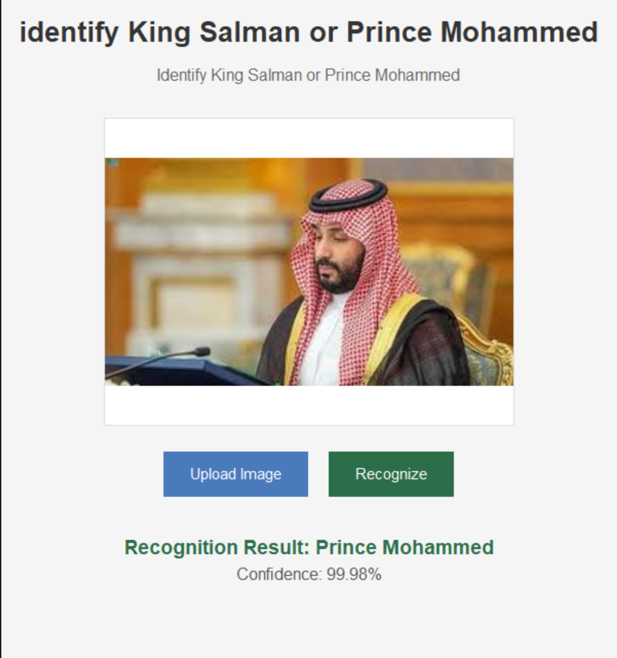

# face-recognition

A Python GUI application that recognizes King Salman and Prince Mohammed bin Salman using a pre-trained Keras model.

## Features

- Simple image upload interface
- Real-time image preview
- Recognition results with confidence percentage
- Clean, modern user interface
- Cross-platform compatibility

## Requirements

- Python 3.6+
- TensorFlow/Keras
- OpenCV
- Pillow (PIL)
- NumPy

## Steps 
- traine the model in pre-trained keras model 
- write the python GUI code
- run the model using the python code 
